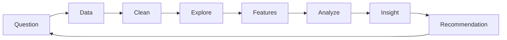

# Analysis Workflow

```mermaid
flowchart LR
Q[Question]-->D[Data]-->C[Clean]-->E[Explore]-->F[Features]-->A[Analyze]-->I[Insight]-->R[Recommendation]
R-->Q
```

For every analysis write the decision the result is supposed to inform. Avoid charts without a question.
