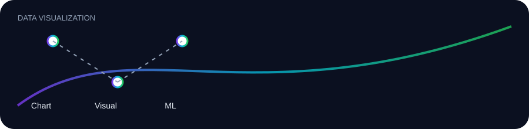

# Data Visualization — Data Visualization

> **Learning contract:** understand the idea, express it precisely, derive the mechanism when useful, implement a minimal version, use the production tool, test failure cases, and explain the trade-offs.

## Scope

**choose → encode → annotate → validate → communicate**

This chapter is intentionally layered so a beginner can start from first principles while an interviewer or engineer can jump directly to implementation and failure analysis.

## How to study every topic

1. **Definition** — state what the concept is without jargon.
2. **Mental model** — describe what the computer/model is doing.
3. **Mechanism** — show the sequence of operations.
4. **Formalism** — equations, types, invariants or SQL semantics where applicable.
5. **Minimal implementation** — build the smallest correct example.
6. **Production implementation** — use established libraries/patterns.
7. **Failure modes** — deliberately break assumptions and diagnose the result.
8. **Practice** — solve easy → medium → hard → challenge exercises.
9. **Evidence** — record outputs, metrics, assumptions and limitations.
10. **Teach-back** — explain the concept in your own words.

## Topic map

- [Chart Selection](01-chart-selection.md) — Match analytical questions to bars, lines, distributions, scatter plots, heatmaps and tables.
- [Visual Grammar](02-visual-grammar.md) — Axes, scales, color, labels, hierarchy, accessibility and misleading-chart detection.
- [ML Visualizations](03-ml-visuals.md) — Decision boundaries, confusion matrices, residuals, calibration, feature importance and learning curves.

## Master checklist

- [ ] I can define each concept precisely.
- [ ] I can implement a small example without copying a library abstraction blindly.
- [ ] I know the important edge cases and failure modes.
- [ ] I can test the behavior.
- [ ] I can explain when the concept is useful and when it is not.
- [ ] I can answer a “why?” interview question about it.
- [ ] I can connect it to the next layer of the curriculum.

## Practice protocol

For each topic, create one notebook or script with: **objective → setup → baseline → experiment → result → interpretation → failure analysis → next step**. Never record a metric without recording the dataset, split, metric definition and comparison baseline.

## Exit challenge

Build one small artifact that combines at least three concepts from this chapter, add tests for its critical behavior, document a failure you found, and explain one design decision in a short engineering note.
