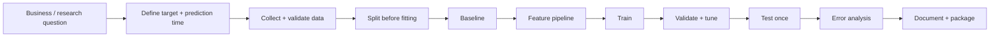

# Machine Learning Lab

> **Goal:** understand why a model works, how it fails, how to measure it, and how to turn the experiment into a reproducible system.

## 1. The ML problem

Machine learning learns a relationship from examples instead of encoding every rule manually. A useful abstraction is:

**data → representation → model → prediction → loss/metric → feedback**

A production ML problem begins with a decision, not an algorithm. Define the target, prediction time, available features, cost of errors, constraints, and baseline before training.

## 2. Learning settings

| Setting | Core idea | Typical task | Main risk |
|---|---|---|---|
| Supervised | learn from labelled examples | classification/regression | leakage, overfitting |
| Unsupervised | discover structure without labels | clustering/dimensionality reduction | unstable interpretation |
| Semi-supervised | combine small labelled data with larger unlabelled data | classification | confirmation bias |

## 3. Algorithm catalogue

- [Linear Regression](./algorithms/linear-regression.md)
- [Logistic Regression](./algorithms/logistic-regression.md)
- [KNN](./algorithms/knn.md)
- [Naive Bayes](./algorithms/naive-bayes.md)
- [Decision Trees](./algorithms/decision-trees.md)
- [Random Forest](./algorithms/random-forest.md)
- [Gradient Boosting](./algorithms/gradient-boosting.md)
- [XGBoost](./algorithms/xgboost.md)
- [SVM](./algorithms/svm.md)
- [K-Means](./algorithms/k-means.md)
- [DBSCAN](./algorithms/dbscan.md)
- [PCA](./algorithms/pca.md)

## 4. The universal experiment

## 5. Evaluation

Classification needs more than accuracy. Choose metrics from the decision cost: precision/recall/F1 for class trade-offs, ROC-AUC for ranking across thresholds, PR-AUC for imbalanced positive classes. Regression commonly uses MAE, MSE/RMSE and R², each answering a different question.

See [model evaluation](./model-evaluation.md).

## 6. Feature engineering

Scaling, encoding, missing-value treatment, transformations, aggregation and dimensionality reduction must be fit only on training data when they learn from the distribution. Put transformations inside a pipeline to reduce leakage.

## 7. Failure modes

- Data leakage
- Target leakage through timestamps or post-outcome fields
- Train/test contamination
- Class imbalance hidden by accuracy
- Distribution shift
- Overfitting to validation
- Misleading feature importance
- Uncalibrated probabilities
- Duplicate entities across splits

## 8. From scratch → library → production

For important algorithms, first implement the core idea with NumPy, then reproduce it with scikit-learn, then package preprocessing + model + evaluation into a reproducible pipeline.

## Mastery gate

You are not finished when you can call `.fit()`. You are finished when you can **define the problem, establish a baseline, choose a defensible metric, prevent leakage, explain the model, analyze errors, reproduce the result, and communicate limitations.**
