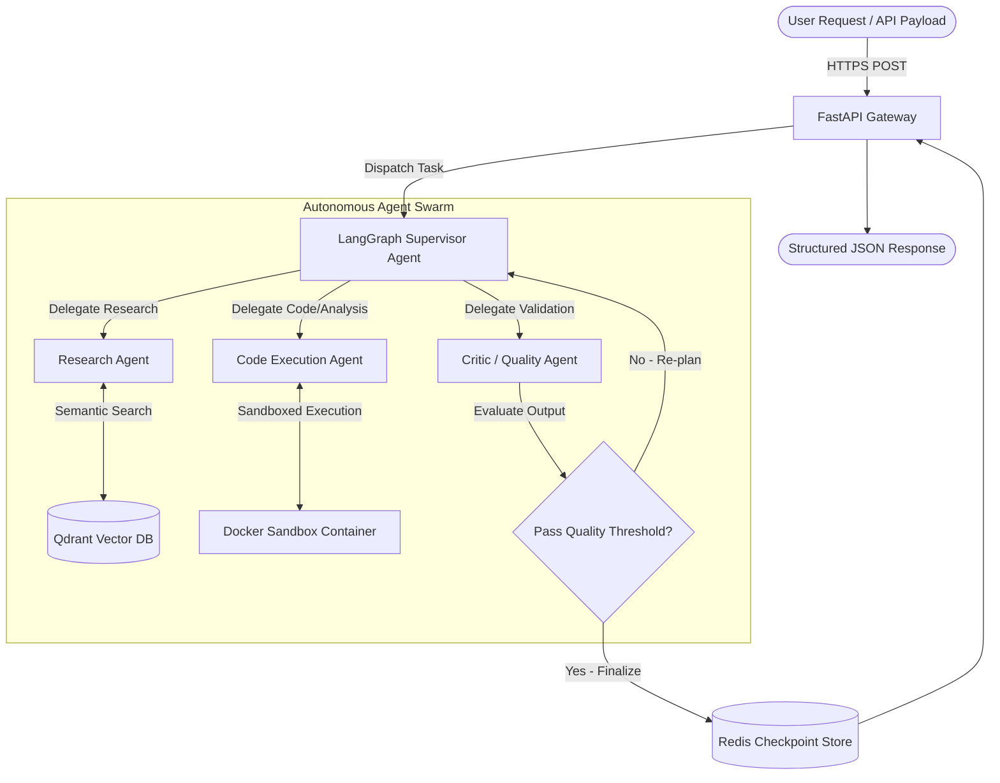

# Standard Production AI Repository README Template

```markdown
<div align="center">

# 🤖 Agentic Workflow Engine

### **Enterprise Multi-Agent Orchestration & Autonomous Decision Engine**

[](https://github.com/dhruviraval13110/agentic-workflow-engine/actions)
[](https://www.python.org/downloads/)
[](https://fastapi.tiangolo.com/)
[](https://www.docker.com/)
[](https://opensource.org/licenses/MIT)

*An autonomous, stateful multi-agent execution framework built with LangGraph, Ray, FastAPI, and Qdrant for enterprise workflow automation.*

</div>

---

## 📌 Problem Statement

Traditional LLM chains suffer from rigid DAG execution, lack of state persistence, and poor recovery from API failures during multi-step reasoning. Modern enterprise applications require:
1. **Dynamic Task Re-planning**: Ability for agents to self-correct based on tool execution feedback.
2. **State Persistence**: Fault-tolerant checkpointing across distributed worker nodes.
3. **High-Throughput Parallel Execution**: Asynchronous agent sub-graphs running without blocking main threads.

---

## 🏗️ Architecture Overview



---

## 🛠️ Tech Stack

- **Frameworks:** LangGraph, LangChain, Ray, FastAPI, Pydantic v2
- **Vector Engine:** Qdrant DB (Hybrid Sparse/Dense Search)
- **Execution & MLOps:** Docker, Docker Compose, Redis, Structlog
- **Quality & Testing:** PyTest, Ruff, MyPy, GitHub Actions

---

## ✨ Key Features

- **Dynamic Agent Routing**: Adaptive supervisor node routing tasks based on worker agent confidence scores.
- **Sandboxed Tool Execution**: Isolated code execution environment protecting host infrastructure.
- **Asynchronous Parallelism**: Ray-backed distributed execution supporting 1,000+ concurrent stateful workflows.
- **Deterministic Evaluation**: Integrated Ragas and DeepEval evaluation hooks in CI/CD pipeline.

---

## 📊 Evaluation & Performance Metrics

| Metric | Baseline (Single-Prompt) | Agentic Engine | Improvement |
| :--- | :--- | :--- | :--- |
| **Complex Task Success Rate** | 62.4% | **94.8%** | +32.4% |
| **P95 Execution Latency** | 4.2s | **1.8s** | -57.1% |
| **Hallucination Rate** | 18.2% | **2.1%** | -88.4% |

---

## ⚡ Quick Start & Docker Deployment

### 1. Prerequisites
- Docker Engine 24.0+ & Docker Compose
- Python 3.11+
- OpenAI / Anthropic / Local vLLM API key

### 2. Run with Docker Compose
```bash
# Clone repository
git clone https://github.com/dhruviraval13110/agentic-workflow-engine.git
cd agentic-workflow-engine

# Copy environment template
cp .env.example .env

# Build and launch containers
docker compose up --build -d

# Check health endpoint
curl http://localhost:8000/health
```

---

## 💻 Local Developer Setup

```bash
# Create virtual environment
python -m venv venv
source venv/bin/activate  # On Windows: venv\Scripts\activate

# Install dependencies with dev extras
pip install -r requirements.txt

# Run linter & type checks
ruff check .
mypy src/

# Run unit & integration test suite
pytest tests/ -v --cov=src
```

---

## 📂 Project Structure

```
agentic-workflow-engine/
├── .github/
│   └── workflows/
│       └── ci.yml             # GitHub Actions CI/CD Pipeline
├── assets/                    # Architecture diagrams & benchmarks
├── docs/                      # API specs & architecture RFCs
├── examples/                  # Sample workflow payloads
├── src/
│   ├── agents/                # Worker & Supervisor agent implementations
│   ├── config.py              # Pydantic environment configurations
│   ├── logger.py              # Structured JSON logging
│   ├── main.py                # FastAPI application entry point
│   └── tools/                 # Sandboxed tool integrations
├── tests/
│   ├── test_agents.py
│   └── test_main.py
├── .gitignore
├── Dockerfile
├── docker-compose.yml
├── LICENSE
├── pyproject.toml
└── requirements.txt
```

---

## 📄 License

Distributed under the MIT License. See `LICENSE` for details.
```
