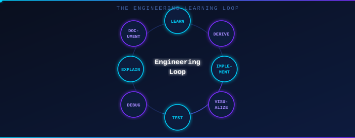
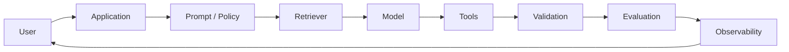
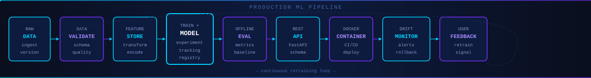

<div align="center">



<br/>

<p>
<a href="https://github.com/dhruviraval13110/python-for-ai-engineering/actions/workflows/python-tests.yml">
  
</a>
<a href="https://github.com/dhruviraval13110/python-for-ai-engineering/actions/workflows/quality.yml">
  
</a>


</p>

<p>
<a href="#-curriculum">Curriculum</a> ·
<a href="#-how-to-study-every-topic">Study System</a> ·
<a href="#-machine-learning">Machine Learning</a> ·
<a href="#-deep-learning">Deep Learning</a> ·
<a href="#-genai--llm-engineering">GenAI</a> ·
<a href="#-mlops--deployment">MLOps</a> ·
<a href="#-research">Research</a> ·
<a href="#-run-locally">Run</a>
</p>

</div>

---

## What this repository is

A **textbook + laboratory + engineering portfolio** built on a single principle. The Python Foundations module is now a full deep-course track rather than short notes:

> **A topic is not complete because it was watched. It is complete when it can be understood, implemented, tested, investigated and explained.**

The learning path moves from Python fundamentals through mathematical foundations, classical ML, deep learning, modern AI systems, production engineering, and research — each layer building on the last.

---

## ⚡ The Engineering Learning Loop

<div align="center">



</div>

Every topic follows the same recursive standard:

```
Learn → Derive → Implement → Visualize → Test → Debug → Explain → Document
```

This loop repeats at increasing depth across the curriculum.

---

## 🗺️ Curriculum

<div align="center">



</div>

| # | Layer | Coverage |
|---:|---|---|
| **01** | [Python Foundations](./01-python-foundations/) | Syntax · Types · OOP · Decorators · Generators · Testing · Tooling |
| **02** | [Python for Data](./02-python-for-data/) | NumPy · Pandas · Vectorization · Feature Engineering · Performance |
| **03** | [Mathematics for ML](./03-mathematics-for-ml/) | Linear Algebra · Calculus · Probability · Optimization |
| **04** | [Statistics](./04-statistics/) | Distributions · Inference · Hypothesis Testing · Uncertainty |
| **05** | [Data Analysis](./05-data-analysis/) | Problem Framing · EDA · Feature Engineering · Decision Analysis |
| **06** | [Data Visualization](./06-data-visualization/) | Analytical Visualization · ML Diagnostics |
| **07** | [SQL](./07-sql/) | Queries · Joins · CTEs · Windows · Schema Design · Optimization |
| **08** | [Machine Learning](./08-machine-learning/) | Regression · Classification · Clustering · Dimensionality Reduction |
| **09** | [Deep Learning](./09-deep-learning/) | Neural Networks · Backprop · CNNs · Sequences · Attention · Transformers |
| **10** | [Computer Vision](./10-computer-vision/) | Classification · Transfer Learning · Detection · Segmentation · OCR |
| **11** | [NLP](./11-nlp/) | Embeddings · Transformers · Sequence Models |
| **12** | [Generative AI](./12-generative-ai/) | LLM Foundations · Prompting · RAG · Evaluation · Safety |
| **13** | [LLM Engineering](./13-llm-engineering/) | Agents · Memory · Structured Outputs · Reliability · Cost |
| **14** | [MLOps](./14-mlops/) | Reproducibility · Experiment Tracking · CI · Monitoring · Drift |
| **15** | [Deployment](./15-deployment/) | APIs · Docker · CI/CD · Production Readiness |
| **16** | [Research](./16-research/) | Hypotheses · Baselines · Controlled Experiments · Error Analysis |

---

## 🎓 How to Study Every Topic

Every topic follows the same **12-layer textbook standard**:

```
01  Definition
 ↓
02  Why it matters
 ↓
03  Mental model / intuition
 ↓
04  Formal model / mathematics
 ↓
05  Hand-worked example
 ↓
06  Minimal implementation
 ↓
07  Professional library implementation
 ↓
08  Visualization
 ↓
09  Edge cases + failure modes
 ↓
10  Tests + debugging
 ↓
11  Experiment + comparison
 ↓
12  Interview explanation + mastery check
```

**Example — Logistic Regression:**

The expected path is not:
```python
LogisticRegression().fit(X, y)
```

It is:

```
classification problem → sigmoid intuition → probability model
→ loss function → gradient → hand calculation
→ NumPy implementation → sklearn implementation
→ decision boundary → regularization → evaluation → error analysis
```

This standard is applied across every topic in the curriculum.

---

## 🐍 01 — Python Foundations

### Fundamentals
`Variables` · `Data Types` · `Operators` · `Conditions` · `Loops` · `Functions` · `Scope`

### Data Structures
`Lists` · `Tuples` · `Sets` · `Dictionaries` · `Strings` · `Comprehensions`

### Engineering Python
`Exceptions` · `Files` · `Modules` · `Packages` · `OOP` · `Decorators` · `Generators` · `Iterators` · `Context Managers` · `Type Hints` · `Dataclasses`

### Professional Tooling
`venv` · `pip` · `pytest` · `logging` · `mypy` · `ruff` · `black` · Git Workflows · API Basics · Async Basics

→ **[Open Python Foundations — Deep Course](./01-python-foundations/)**

---

## 📊 02 — Python for Data

### NumPy
Arrays · Shape & Dimensions · Indexing & Slicing · Broadcasting · Vectorization · Dtypes · Aggregation · Matrix Operations · Linear Algebra

### Pandas
Series / DataFrame · Loading Datasets · Filtering · Sorting · Missing Values · Duplicates · GroupBy · Merge / Join · Pivoting · Datetime · Strings · Feature Engineering · Performance

→ **[Open Python for Data](./02-python-for-data/)**

---

## 🧮 03–04 — Mathematics + Statistics

Machine learning is built on mathematical and statistical foundations.

```
Linear Algebra
     ↓
Calculus
     ↓
Gradients
     ↓
Probability
     ↓
Optimization
     ↓
Machine Learning
```

### Statistics Coverage
Descriptive statistics · Probability distributions · Sampling · Estimation · Confidence intervals · Hypothesis testing · Correlation · Experimental reasoning · Uncertainty · Common statistical mistakes

→ [Mathematics for ML](./03-mathematics-for-ml/) · [Statistics](./04-statistics/)

---

## 📈 05–07 — Data Analysis, Visualization + SQL

```
Business Question
       ↓
Data Model
       ↓
SQL
       ↓
Data Quality
       ↓
EDA
       ↓
Feature Engineering
       ↓
Statistical Reasoning
       ↓
Model / Decision
```

**SQL includes:**
`SELECT` · `WHERE` · `GROUP BY` · `HAVING` · `JOIN` · `CASE` · `Subqueries` · `CTEs` · `Window Functions` · `Indexes` · `Normalization` · `Query Optimization`

→ [Data Analysis](./05-data-analysis/) · [Visualization](./06-data-visualization/) · [SQL](./07-sql/)

---

## 🤖 Machine Learning

<div align="center">



</div>

### Supervised Learning
Linear Regression · Logistic Regression · KNN · Naive Bayes · Decision Trees · Random Forest · Gradient Boosting · XGBoost · SVM

### Unsupervised Learning
K-Means · DBSCAN · PCA

### From-Scratch Implementations
Selected algorithms implemented from first principles — Linear Regression, Logistic Regression, K-Means — to remove the black box before using higher-level libraries.

### Evaluation Framework

Every experiment explicitly defines:

| Component | Question |
|---|---|
| Split | How is unseen data protected? |
| Baseline | What does a simple solution achieve? |
| Preprocessing | What transformations are applied? |
| Leakage | Could future information enter training? |
| Metric | What does success mean for this problem? |
| Error Analysis | Where does the model fail? |
| Decision | What should change next? |

**Metrics:** `Accuracy` · `Precision` · `Recall` · `F1` · `ROC-AUC` · `PR-AUC` · `MAE` · `MSE` · `RMSE` · `R²`

→ **[Open Machine Learning](./08-machine-learning/)**

---

## 🧠 Deep Learning

```
Perceptron
   ↓
Dense Network
   ↓
Forward Pass → Loss → Backpropagation
   ↓
Gradient Descent → Optimization
   ↓
CNN / RNN / LSTM
   ↓
Attention
   ↓
Transformers
```

**Topics:** Activation Functions · Forward Propagation · Loss Functions · Backpropagation · Optimizers · Learning Rate · Regularization · CNNs · RNNs · LSTMs / GRUs · Attention · Transformers

→ **[Open Deep Learning](./09-deep-learning/)**

---

## 👁️ 10 — Computer Vision

`Image Classification` · `CNNs` · `Preprocessing` · `Augmentation` · `Transfer Learning` · `Object Detection` · `Segmentation` · `OCR` · `Similarity`

**Pipeline:** `input → preprocessing → representation → model → prediction → evaluation → error analysis`

→ **[Open Computer Vision](./10-computer-vision/)**

---

## 🔤 11 — NLP

`Text Processing` · `Representations` · `Embeddings` · `Sequence Models` · `Transformers` · `Fine-tuning`

→ **[Open NLP](./11-nlp/)**

---

## ✨ GenAI + LLM Engineering

### 12 — Generative AI

`LLM Foundations` · `Prompt Engineering` · `Embeddings` · `RAG` · `Evaluation` · `Safety`

### 13 — LLM Engineering


```mermaid
flowchart LR
  U[User] --> API[Application]
  API --> P[Prompt / Policy]
  P --> R[Retriever]
  R --> M[Model]
  M --> T[Tools]
  T --> V[Validation]
  V --> E[Evaluation]
  E --> O[Observability]
  O --> U
```

**Topics:** Prompt Templates · Function / Tool Calling · Agents · Memory · RAG · Structured Outputs · Evaluation · Guardrails · Latency · Cost · Caching · Observability

→ **[Open Generative AI](./12-generative-ai/)** · **[Open LLM Engineering](./13-llm-engineering/)**

---

## ⚙️ MLOps + Deployment

<div align="center">



</div>

### MLOps
Git · Reproducibility · Data / Model Versioning · Experiment Tracking · Model Registries · Testing · CI/CD · Monitoring · Drift · Rollback

### Deployment
API Design · Model Serving · Docker · Environment Configuration · Secrets Management · CI/CD · Production Readiness

→ [MLOps](./14-mlops/) · [Deployment](./15-deployment/)

---

## 🔬 Research

Research is treated as a controlled engineering process.

```
Question
   ↓
Hypothesis
   ↓
Baseline
   ↓
Controlled Change
   ↓
Measurement
   ↓
Error Analysis
   ↓
Conclusion
   ↓
Next Experiment
```

Every experiment records: hypothesis · dataset · baseline · method · controlled variable · measurements · interpretation · limitations · next experiment

→ **[Open Research](./16-research/)**

---

## 💼 Projects

### Beginner
Small complete systems that establish fundamentals.

### Intermediate
Projects combining: **Data + Analysis + ML + Evaluation + APIs**

### Advanced

```
Frontend
   ↕
Backend
   ↕
AI / ML Service
   ↕
Database / Vector Store
   ↕
Evaluation
   ↕
Monitoring
```

Each serious project documents: problem · decision context · dataset · baseline · architecture · methodology · metrics · error analysis · limitations · reproduction · tests · future work

→ **[Open Projects](./projects/)**

---

## 🧪 Experiments

Questions the experiment layer answers:

- Does scaling change SVM behavior?
- What happens when classes are imbalanced?
- How does augmentation affect generalization?
- How does chunk size affect RAG retrieval?
- Which failure modes dominate a model?

Every experiment compares a **baseline against a controlled change** rather than reporting a final number in isolation.

---

## 🎯 Interview Preparation

| Area | Practice |
|---|---|
| Python | Fundamentals · Coding · Debugging |
| SQL | Queries · Joins · Windows · Optimization |
| Statistics | Probability · Inference · Experiments |
| ML | Algorithms · Metrics · Leakage · Model Selection |
| DL | Networks · Gradients · Optimization |
| NLP / CV | Representations and Architectures |
| GenAI | RAG · Evaluation · Prompting |
| MLOps | Deployment · Monitoring · Reliability |
| System Design | End-to-End AI Architecture |

> **Explain what happens, why it happens, what can fail, and how you would debug it.**

→ **[Open Interview Preparation](./interview-preparation/)**

---

## 🧱 Engineering Standards

- Python 3.11+
- Reproducible environments
- Small, testable modules
- Meaningful names · Type hints · Docstrings
- Ruff · Black · pytest · mypy
- CI quality gates
- Configuration separated from secrets
- Deterministic examples where possible
- No fabricated metrics, deployments, or certifications

---

## 🔍 Reviewer Quick Path

```
README
  ↓
Python
  ↓
Math + Statistics
  ↓
Data + SQL
  ↓
Machine Learning
  ↓
Deep Learning
  ↓
NLP / CV
  ↓
GenAI / LLM Engineering
  ↓
MLOps / Deployment
  ↓
Projects
  ↓
Research
```

Each layer provides evidence through **code · experiments · tests · explanations · documentation**.

---

## 📁 Repository Architecture

```
python-for-ai-engineering/
│
├── 01-python-foundations/
├── 02-python-for-data/
├── 03-mathematics-for-ml/
├── 04-statistics/
├── 05-data-analysis/
├── 06-data-visualization/
├── 07-sql/
├── 08-machine-learning/
├── 09-deep-learning/
├── 10-computer-vision/
├── 11-nlp/
├── 12-generative-ai/
├── 13-llm-engineering/
├── 14-mlops/
├── 15-deployment/
├── 16-research/
│
├── projects/
│   ├── beginner/
│   ├── intermediate/
│   └── advanced/
│
├── experiments/
├── notebooks/
├── examples/
├── interview-preparation/
├── resources/
│
├── src/
├── tests/
├── assets/
├── docs/
│
├── pyproject.toml
├── requirements.txt
├── Makefile
├── CONTRIBUTING.md
├── LICENSE
└── README.md
```

---

## 🚀 Run Locally

### Windows (PowerShell)

```powershell
py -3.11 -m venv .venv
.venv\Scripts\Activate.ps1
python -m pip install --upgrade pip
python -m pip install -r requirements.txt
pytest -q
ruff check .
```

### macOS / Linux

```bash
python3.11 -m venv .venv
source .venv/bin/activate
pip install --upgrade pip
pip install -r requirements.txt
pytest -q
ruff check .
```

### Run an example

```bash
python examples/01_variables/variables.py
```

### Run an ML implementation

```bash
python 08-machine-learning/from_scratch/linear_regression.py
```

---

## 🛡️ Responsible AI Engineering

AI systems are probabilistic and can fail. High-impact systems require:

- Human oversight
- Privacy protection
- Security controls
- Domain review
- Evaluation and uncertainty awareness
- Clear escalation paths

> Knowing **when not to trust a model** is part of AI engineering.

---

## 📚 Documentation

- [Architecture](./docs/architecture.md)
- [Coding Guidelines](./docs/coding-guidelines.md)
- [Roadmap](./docs/roadmap.md)
- [Contributing](./CONTRIBUTING.md)
- [License](./LICENSE)

---

<div align="center">


<br/>

## Build evidence, not decoration.

**Understand deeply · Build reproducibly · Measure honestly · Explain clearly**

</div>


---

## 🐍 Python Mastery — Zero to AI Engineer

A dedicated deep-learning track takes you from Python fundamentals to production-oriented AI engineering. It contains 20 detailed chapters, runnable examples, exercises, tests, and progressive projects.

👉 **[Start Python Mastery](./python-mastery/README.md)**

The goal is not passive reading: **learn → code → break → debug → test → explain → build**.
