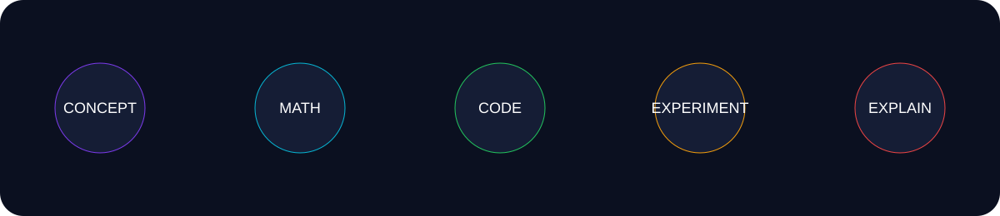
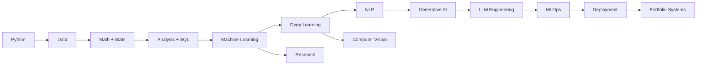
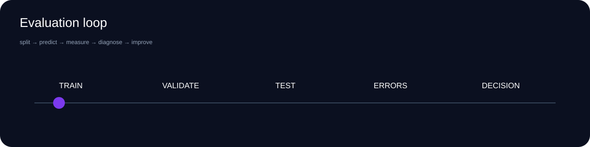

<div align="center">



# Python for AI Engineering

### A structured, reproducible path from Python fundamentals to machine learning, deep learning, GenAI, LLM systems, MLOps and research

[](https://github.com/dhruviraval13110/python-for-ai-engineering/actions/workflows/python-tests.yml)
[](https://github.com/dhruviraval13110/python-for-ai-engineering/actions/workflows/quality.yml)
[](https://www.python.org/)
[](./LICENSE)

</div>

---

> **Engineering loop:** Learn → derive → implement → visualize → test → experiment → debug → explain → document.

## What this repository is

This is a **textbook + laboratory + portfolio engineering system**. It is organized so that a reader can move from absolute Python foundations through data work, mathematics, statistics, classical ML, deep learning, NLP, computer vision, generative AI, LLM engineering, MLOps, deployment and research.

The standard for every topic is higher than “I watched a tutorial”: the learner should be able to explain the mechanism, write a minimal implementation, use the appropriate professional tool, test it, analyze failures and communicate limitations.

## Curriculum

| # | Layer | What you learn |
|---:|---|---|
| 01 | [Python Foundations](./01-python-foundations/) | Syntax, control flow, data structures, functions, OOP, advanced Python, tooling |
| 02 | [Python for Data](./02-python-for-data/) | NumPy, Pandas, feature engineering, performance |
| 03 | [Mathematics for ML](./03-mathematics-for-ml/) | Linear algebra, calculus, probability, optimization |
| 04 | [Statistics](./04-statistics/) | Descriptive stats, inference, experiments, uncertainty |
| 05 | [Data Analysis](./05-data-analysis/) | Framing, cleaning, EDA, decision-oriented insights |
| 06 | [Data Visualization](./06-data-visualization/) | Analytical and ML visualizations |
| 07 | [SQL](./07-sql/) | Queries, joins, windows, schema design, performance |
| 08 | [Machine Learning](./08-machine-learning/) | Algorithms, evaluation, feature engineering, from-scratch labs |
| 09 | [Deep Learning](./09-deep-learning/) | Neural networks, backprop, CNNs, sequences, transformers |
| 10 | [Computer Vision](./10-computer-vision/) | Classification, transfer learning, detection, segmentation, OCR |
| 11 | [NLP](./11-nlp/) | Text representations, embeddings, sequence models, transformers |
| 12 | [Generative AI](./12-generative-ai/) | LLM foundations, prompting, RAG, evaluation, safety |
| 13 | [LLM Engineering](./13-llm-engineering/) | Tools, agents, memory, structured outputs, production concerns |
| 14 | [MLOps](./14-mlops/) | Reproducibility, tracking, registries, testing, monitoring |
| 15 | [Deployment](./15-deployment/) | APIs, Docker, CI/CD, production readiness |
| 16 | [Research](./16-research/) | Hypotheses, experiments, ablations, error analysis, literature notes |

## Learning architecture


```mermaid
flowchart LR
P[Python]-->D[Data]
D-->M[Math + Stats]
M-->A[Analysis + SQL]
A-->ML[Machine Learning]
ML-->DL[Deep Learning]
DL-->N[NLP]
DL-->CV[Computer Vision]
N-->G[Generative AI]
G-->L[LLM Engineering]
ML-->R[Research]
L-->O[MLOps]
O-->DEP[Deployment]
DEP-->PORT[Portfolio Systems]
```

## What “complete” means here

A topic is considered studied only when the learner can move through these layers:

**Definition → intuition → formal model → hand-worked example → minimal code → professional library → visualization → edge cases → tests → experiment → failure analysis → interview explanation.**

## Machine Learning Lab

The ML layer contains dedicated study guides and educational from-scratch implementations for core algorithms.

### From scratch

- Linear Regression
- Logistic Regression
- K-Means

### Classical algorithms

Linear/Logistic Regression · KNN · Naive Bayes · Decision Trees · Random Forest · Gradient Boosting · XGBoost · SVM · K-Means · DBSCAN · PCA

### Evaluation first



Every experiment must define its split, baseline, metric, preprocessing, leakage controls, result and error analysis.

## Production path


**data → validation → features → model → evaluation → artifact → API → container → monitoring → feedback**

A production architecture is not a claim that a deployment exists. Deployment status is documented only when it is actually built and verified.

## Portfolio project system

The project catalogue includes beginner, intermediate and advanced architectures around customer analytics, forecasting, RAG, visual inspection, inventory, spam detection and ML APIs. Every project uses the same evidence contract:

- Problem + decision context
- Dataset/data contract
- Baseline
- Architecture
- Methodology
- Metrics + justification
- Error analysis
- Limitations
- Reproduction instructions
- Tests
- Future improvements

## Research system

```text
Hypothesis
   ↓
Baseline
   ↓
Controlled change
   ↓
Measurement
   ↓
Error analysis
   ↓
Conclusion
   ↓
Next experiment
```

See [Research](./16-research/) and [Experiment Template](./16-research/experiment-template.md).

## Engineering standards

- Python 3.11+
- Small, testable modules
- Type hints and docstrings where useful
- Ruff / Black / pytest / mypy
- CI quality gates
- Configuration separated from secrets
- Reproducible commands
- Explicit assumptions and limitations
- No fabricated metrics, employment, certifications, datasets, users or deployments

## Run locally

```powershell
py -3.11 -m venv .venv
.venv\Scripts\Activate.ps1
python -m pip install -r requirements.txt
pytest -q
ruff check .
```

Run examples:

```powershell
python examples/01_variables/variables.py
python 08-machine-learning/from_scratch/linear_regression.py
```

## Repository map

```text
01-16 curriculum/        textbook chapters + labs
examples/                 runnable Python foundations
08-machine-learning/     algorithms + from-scratch implementations
projects/                portfolio system specifications
experiments/              research notebook layer
interview-preparation/   interview training
notebooks/               reproducible exploration format
src/                     reusable engineering utilities
tests/                   automated tests
assets/                  animated technical visuals
.github/                 CI, security and contribution automation
docs/                    architecture + quality documentation
```

## Recruiter / reviewer quick path

**Start:** root README → [ML](./08-machine-learning/) → [Projects](./projects/) → [Research](./16-research/) → [Engineering standards](./docs/quality-checklist.md).

## Responsible engineering

Models are probabilistic systems, not authorities. High-impact applications require domain review, privacy protection, security controls, appropriate evaluation and a human escalation path.

## License

MIT — see [LICENSE](./LICENSE).
