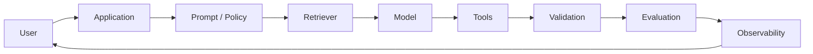

<div align="center">


# Python for AI Engineering

### **A structured, reproducible AI/ML engineering curriculum — from Python fundamentals to machine learning, deep learning, GenAI, LLM systems, MLOps and research.**

<p>
<a href="https://github.com/dhruviraval13110/python-for-ai-engineering/actions/workflows/python-tests.yml"></a>
<a href="https://github.com/dhruviraval13110/python-for-ai-engineering/actions/workflows/quality.yml"></a>

<a href="./LICENSE"></a>
</p>

<p>
<a href="#-curriculum">Curriculum</a> ·
<a href="#-how-to-study-every-topic">Study System</a> ·
<a href="#-machine-learning">Machine Learning</a> ·
<a href="#-deep-learning">Deep Learning</a> ·
<a href="#-genai--llm-engineering">GenAI</a> ·
<a href="#-mlops--deployment">MLOps</a> ·
<a href="#-research">Research</a> ·
<a href="#-run-locally">Run</a>
</p>

</div>

---

<div align="center">


</div>

## 🧭 What this repository is

This repository is a **textbook + laboratory + engineering portfolio**.

It is designed around a single principle:

> **A topic is not complete because it was watched. It is complete when it can be understood, implemented, tested, investigated and explained.**

The learning path moves from programming fundamentals to the mathematical and statistical foundations of ML, then into classical ML, deep learning, modern AI systems, production engineering and research.

---

## ⚡ Engineering Learning Loop

<div align="center">


</div>

The recurring loop is:

**Learn → derive → implement → visualize → test → experiment → debug → explain → document**

This is the standard used throughout the repository.

---

# 🗺️ Curriculum

| # | Layer | Coverage |
|---:|---|---|
| **01** | [Python Foundations](./01-python-foundations/) | Syntax, types, control flow, functions, collections, OOP, advanced Python, testing and tooling |
| **02** | [Python for Data](./02-python-for-data/) | NumPy, Pandas, vectorization, cleaning, feature engineering and performance |
| **03** | [Mathematics for ML](./03-mathematics-for-ml/) | Linear algebra, calculus, probability and optimization |
| **04** | [Statistics](./04-statistics/) | Descriptive statistics, distributions, inference, experiments and uncertainty |
| **05** | [Data Analysis](./05-data-analysis/) | Problem framing, cleaning, EDA, feature engineering and decision-oriented analysis |
| **06** | [Data Visualization](./06-data-visualization/) | Analytical visualization and ML diagnostics |
| **07** | [SQL](./07-sql/) | Queries, joins, CTEs, windows, schema design and performance |
| **08** | [Machine Learning](./08-machine-learning/) | Regression, classification, clustering, dimensionality reduction and evaluation |
| **09** | [Deep Learning](./09-deep-learning/) | Neural networks, backpropagation, optimization, CNNs, sequences and attention |
| **10** | [Computer Vision](./10-computer-vision/) | Classification, transfer learning, detection, segmentation and OCR |
| **11** | [NLP](./11-nlp/) | Text processing, representations, embeddings, sequence models and transformers |
| **12** | [Generative AI](./12-generative-ai/) | LLM foundations, prompting, embeddings, RAG, evaluation and safety |
| **13** | [LLM Engineering](./13-llm-engineering/) | Tools, agents, memory, structured outputs, reliability, latency and cost |
| **14** | [MLOps](./14-mlops/) | Reproducibility, tracking, versioning, CI, monitoring and drift |
| **15** | [Deployment](./15-deployment/) | APIs, containers, CI/CD and production readiness |
| **16** | [Research](./16-research/) | Hypotheses, baselines, controlled experiments, ablations and error analysis |

---

# 🎓 How to Study Every Topic

Every major topic follows the same **12-layer textbook standard**:

```text
01  Definition
 ↓
02  Why it matters
 ↓
03  Mental model / intuition
 ↓
04  Formal model / mathematics
 ↓
05  Hand-worked example
 ↓
06  Minimal implementation
 ↓
07  Professional library implementation
 ↓
08  Visualization
 ↓
09  Edge cases + failure modes
 ↓
10  Tests + debugging
 ↓
11  Experiment + comparison
 ↓
12  Interview explanation + mastery check
```

### Example

For **Logistic Regression**, the expected learning path is not simply:

```python
LogisticRegression().fit(X, y)
```

It is:

**classification problem → sigmoid intuition → probability model → loss function → gradient → hand calculation → NumPy implementation → sklearn implementation → decision boundary → regularization → evaluation → error analysis**

The same standard is applied progressively across the curriculum.

---

# 🐍 01 — Python Foundations

### Fundamentals

`Variables` · `Data Types` · `Operators` · `Conditions` · `Loops` · `Functions` · `Scope`

### Data structures

`Lists` · `Tuples` · `Sets` · `Dictionaries` · `Strings` · `Comprehensions`

### Engineering Python

`Exceptions` · `Files` · `Modules` · `Packages` · `OOP` · `Decorators` · `Generators` · `Iterators` · `Context Managers` · `Type Hints` · `Dataclasses`

### Professional tooling

`venv` · `pip` · `pytest` · `logging` · `mypy` · `ruff` · `black` · Git workflows · API basics · async basics

→ **[Open Python Foundations](./01-python-foundations/)**

---

# 📊 02 — Python for Data

### NumPy

- arrays
- shape / dimensions
- indexing and slicing
- broadcasting
- vectorization
- dtypes
- aggregation
- matrix operations
- linear algebra

### Pandas

- Series / DataFrame
- loading datasets
- filtering
- sorting
- missing values
- duplicates
- GroupBy
- merge / join
- pivoting
- datetime
- strings
- feature engineering
- performance

→ **[Open Python for Data](./02-python-for-data/)**

---

# 🧮 03–04 — Mathematics + Statistics

Machine learning is built on mathematical and statistical ideas.

### Mathematics

```text
Linear Algebra
     ↓
Calculus
     ↓
Gradients
     ↓
Probability
     ↓
Optimization
     ↓
Machine Learning
```

### Statistics

- descriptive statistics
- probability distributions
- sampling
- estimation
- confidence intervals
- hypothesis testing
- correlation
- experimental reasoning
- uncertainty
- common statistical mistakes

→ [Mathematics for ML](./03-mathematics-for-ml/) · [Statistics](./04-statistics/)

---

# 📈 05–07 — Data Analysis, Visualization + SQL

A model is only as useful as the data and question behind it.

```text
Business Question
       ↓
Data Model
       ↓
SQL
       ↓
Data Quality
       ↓
EDA
       ↓
Feature Engineering
       ↓
Statistical Reasoning
       ↓
Model / Decision
```

SQL includes:

`SELECT` · `WHERE` · `GROUP BY` · `HAVING` · `JOIN` · `CASE` · `Subqueries` · `CTEs` · `Window Functions` · `Indexes` · `Normalization` · `Query Optimization`

→ [Data Analysis](./05-data-analysis/) · [Visualization](./06-data-visualization/) · [SQL](./07-sql/)

---

# 🤖 08 — Machine Learning

The ML layer focuses on **mechanism + implementation + evaluation**.

### Supervised learning

- Linear Regression
- Logistic Regression
- KNN
- Naive Bayes
- Decision Trees
- Random Forest
- Gradient Boosting
- XGBoost
- SVM

### Unsupervised learning

- K-Means
- DBSCAN
- PCA

### From-scratch implementations

Selected algorithms are implemented educationally from first principles, including:

- Linear Regression
- Logistic Regression
- K-Means

The purpose is to remove the black box before using higher-level libraries.

<div align="center">


</div>

### Evaluation framework

Every experiment explicitly defines:

| Component | Question |
|---|---|
| Split | How is unseen data protected? |
| Baseline | What does a simple solution achieve? |
| Preprocessing | What transformations are applied? |
| Leakage | Could future information enter training? |
| Metric | What does success mean for this problem? |
| Error analysis | Where does the model fail? |
| Decision | What should change next? |

Metrics include:

`Accuracy` · `Precision` · `Recall` · `F1` · `ROC-AUC` · `PR-AUC` · `MAE` · `MSE` · `RMSE` · `R²`

→ **[Open Machine Learning](./08-machine-learning/)**

---

# 🧠 09 — Deep Learning

The deep-learning progression:

```text
Perceptron
   ↓
Dense Network
   ↓
Forward Pass
   ↓
Loss
   ↓
Backpropagation
   ↓
Gradient Descent
   ↓
Optimization
   ↓
CNN / Sequence Models
   ↓
Attention
   ↓
Transformers
```

Topics:

- neurons and layers
- activation functions
- forward propagation
- loss functions
- gradients
- backpropagation
- optimizers
- learning rate
- batch size
- epochs
- regularization
- CNNs
- RNNs
- LSTMs / GRUs
- attention
- transformers

→ **[Open Deep Learning](./09-deep-learning/)**

---

# 👁️ 10 — Computer Vision

Coverage:

`Image Classification` · `CNNs` · `Preprocessing` · `Augmentation` · `Transfer Learning` · `Object Detection` · `Segmentation` · `OCR` · `Similarity`

The focus is on understanding the complete image pipeline:

**input → preprocessing → representation → model → prediction → evaluation → error analysis**

→ **[Open Computer Vision](./10-computer-vision/)**

---

# 📝 11 — NLP

Coverage:

`Tokenization` · `Text Cleaning` · `Bag of Words` · `TF-IDF` · `Embeddings` · `Word2Vec intuition` · `Sequence Models` · `Attention` · `Transformers`

The goal is to understand the progression from classical text features to modern transformer-based representations.

→ **[Open NLP](./11-nlp/)**

---

# ✨ 12 — Generative AI

Modern AI engineering requires understanding what happens between the prompt and the generated output.

```text
Tokens
  ↓
Embeddings
  ↓
Context
  ↓
Prompt
  ↓
Retrieval
  ↓
Generation
  ↓
Evaluation
  ↓
Guardrails
```

Topics:

- LLM fundamentals
- tokenization
- embeddings
- context windows
- temperature
- top-k / top-p
- inference
- prompting
- structured outputs
- RAG
- chunking
- retrieval
- reranking
- vector databases
- hallucination analysis
- evaluation
- safety

→ **[Open Generative AI](./12-generative-ai/)**

---

# 🛠️ 13 — LLM Engineering

An LLM application becomes an engineering system when it has controlled interfaces, evaluation and operational constraints.


```mermaid
flowchart LR
U[User] --> API[Application]
API --> P[Prompt / Policy]
P --> R[Retriever]
R --> M[Model]
M --> T[Tools]
T --> V[Validation]
V --> E[Evaluation]
E --> O[Observability]
O --> U
```

Topics:

- prompt templates
- function / tool calling
- agents
- memory
- RAG
- structured outputs
- evaluation
- guardrails
- latency
- cost
- caching
- observability

→ **[Open LLM Engineering](./13-llm-engineering/)**

---

# ⚙️ 14–15 — MLOps + Deployment

<div align="center">


</div>

Production ML connects:

**data → validation → features → model → evaluation → artifact → API → container → monitoring → feedback**

### MLOps

- Git
- reproducibility
- data / model versioning
- experiment tracking
- model registries
- testing
- CI/CD
- monitoring
- drift
- rollback thinking

### Deployment

- API design
- model serving
- Docker
- environment configuration
- secrets management
- CI/CD
- production readiness

→ [MLOps](./14-mlops/) · [Deployment](./15-deployment/)

---

# 🔬 16 — Research

Research is treated as a controlled engineering process.

```text
Question
   ↓
Hypothesis
   ↓
Baseline
   ↓
Controlled Change
   ↓
Measurement
   ↓
Error Analysis
   ↓
Conclusion
   ↓
Next Experiment
```

Every experiment records:

- hypothesis
- dataset
- baseline
- method
- controlled variable
- measurements
- interpretation
- limitations
- next experiment

→ **[Open Research](./16-research/)**

---

# 💼 Projects

Projects are organized by capability rather than project-count inflation.

### Beginner

Small complete systems that establish fundamentals.

### Intermediate

Projects combining:

**data + analysis + ML + evaluation + APIs**

### Advanced

Systems combining:

```text
Frontend
   ↕
Backend
   ↕
AI / ML Service
   ↕
Database / Vector Store
   ↕
Evaluation
   ↕
Monitoring
```

Each serious project should document:

- problem
- decision context
- dataset
- data dictionary
- baseline
- architecture
- methodology
- metrics + justification
- error analysis
- limitations
- reproduction
- tests
- future work

→ **[Open Projects](./projects/)**

---

# 🧪 Experiments

The experiment layer is for answering questions such as:

- Does scaling change SVM behavior?
- What happens when classes are imbalanced?
- How does augmentation affect generalization?
- How does chunk size affect RAG retrieval?
- Which failure modes dominate a model?

Experiments should compare a **baseline against a controlled change**, rather than simply reporting a final number.

---

# 🎯 Interview Preparation

Preparation covers:

| Area | Practice |
|---|---|
| Python | fundamentals, coding, debugging |
| SQL | queries, joins, windows, optimization |
| Statistics | probability, inference, experiments |
| ML | algorithms, metrics, leakage, model selection |
| DL | networks, gradients, optimization |
| NLP / CV | representations and architectures |
| GenAI | RAG, evaluation, prompting |
| MLOps | deployment, monitoring, reliability |
| System Design | end-to-end AI architecture |

The target is not memorization.

> **Explain what happens, why it happens, what can fail, and how you would debug it.**

→ **[Open Interview Preparation](./interview-preparation/)**

---

# 🧱 Engineering Standards

This repository follows explicit engineering rules:

- Python 3.11+
- reproducible environments
- small testable modules
- meaningful names
- type hints where useful
- docstrings where useful
- Ruff
- Black
- pytest
- mypy where appropriate
- CI quality gates
- configuration separated from secrets
- deterministic examples where possible
- explicit assumptions
- explicit limitations
- no fabricated metrics
- no fabricated employment
- no fabricated certifications
- no fabricated users
- no fabricated datasets
- no fabricated deployment claims

---

# 📁 Repository Architecture

```text
python-for-ai-engineering/
│
├── 01-python-foundations/
├── 02-python-for-data/
├── 03-mathematics-for-ml/
├── 04-statistics/
├── 05-data-analysis/
├── 06-data-visualization/
├── 07-sql/
├── 08-machine-learning/
├── 09-deep-learning/
├── 10-computer-vision/
├── 11-nlp/
├── 12-generative-ai/
├── 13-llm-engineering/
├── 14-mlops/
├── 15-deployment/
├── 16-research/
│
├── projects/
│   ├── beginner/
│   ├── intermediate/
│   └── advanced/
│
├── experiments/
├── notebooks/
├── examples/
├── interview-preparation/
├── resources/
│
├── src/
├── tests/
├── assets/
├── docs/
│
├── pyproject.toml
├── requirements.txt
├── Makefile
├── CONTRIBUTING.md
├── LICENSE
└── README.md
```

---

# 🚀 Run Locally

### Windows PowerShell

```powershell
py -3.11 -m venv .venv
.venv\Scripts\Activate.ps1
python -m pip install --upgrade pip
python -m pip install -r requirements.txt
pytest -q
ruff check .
```

### Run an example

```powershell
python examples/01_variables/variables.py
```

### Run an ML implementation

```powershell
python 08-machine-learning/from_scratch/linear_regression.py
```

---

# 🔍 Reviewer Quick Path

If you're evaluating the technical depth of this repository:

```text
README
  ↓
Python
  ↓
Math + Statistics
  ↓
Data + SQL
  ↓
Machine Learning
  ↓
Deep Learning
  ↓
NLP / CV
  ↓
GenAI / LLM Engineering
  ↓
MLOps / Deployment
  ↓
Projects
  ↓
Research
```

Each layer is intended to provide evidence through **code, experiments, tests, explanations and documentation**.

---

# 🛡️ Responsible AI Engineering

AI systems are probabilistic and can fail.

High-impact systems require appropriate:

- human oversight
- privacy protection
- security controls
- domain review
- evaluation
- uncertainty awareness
- escalation paths

Knowing **when not to trust a model** is part of AI engineering.

---

# 📚 Documentation

- [Architecture](./docs/architecture.md)
- [Coding Guidelines](./docs/coding-guidelines.md)
- [Roadmap](./docs/roadmap.md)
- [Contributing](./CONTRIBUTING.md)
- [License](./LICENSE)

---

<div align="center">

## Build evidence, not decoration.

**Understand deeply · Build reproducibly · Measure honestly · Explain clearly**


</div>
