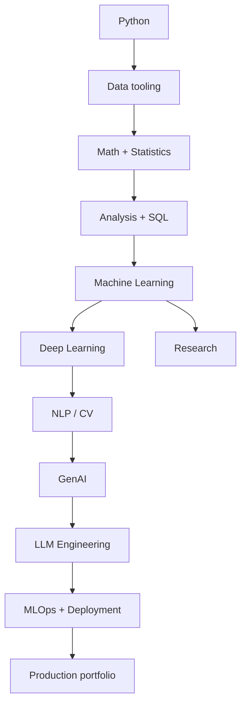

# Curriculum Map

The intended progression is cumulative: later chapters assume the engineering and mathematical habits developed earlier.
## Advanced Study Lab 1: Curriculum Map

### Goal

Use **Curriculum Map** as an engineering problem rather than a vocabulary item. Write the smallest version you can, observe its behavior, then make one assumption fail deliberately.

### Investigation prompts

1. What are the inputs and their valid ranges?
2. What is the smallest useful example?
3. What output should be produced?
4. What invariant should always remain true?
5. What happens at an empty input?
6. What happens at a missing value?
7. What happens at a duplicated value?
8. What happens at a malformed value?
9. What happens when the input becomes 10x larger?
10. Which step is most expensive?
11. What would you log?
12. What would you test?
13. What would you monitor in production?
14. Which assumption is most dangerous?
15. What alternative design would you reject and why?

### Implementation drill

Create a small module with one public function. Give it a precise type signature. Validate inputs at the boundary. Keep transformation logic separate from I/O. Return a predictable result. Write a happy-path test, a boundary test, and an invalid-input test.

### Review drill

Read your implementation as if you were reviewing someone else’s pull request. Look for unclear names, hidden state, duplicated logic, surprising defaults, broad exception handling, missing tests, and documentation that describes what the code does but not why.

### Interview follow-up

An interviewer may start with “Explain Curriculum Map” and then immediately ask for an example, a limitation, a complexity discussion, a failure case, and a production design. Practice answering in that order instead of giving a memorized definition.

### AI/data connection

When **Curriculum Map** appears inside an AI or data pipeline, explicitly identify the data contract, preprocessing assumptions, evaluation signal, reproducibility requirements, and failure policy. A technically correct component can still create a bad system if its assumptions are invisible.

### Mastery proof

- [ ] I implemented it without copying the reference.
- [ ] I wrote tests before or immediately after implementation.
- [ ] I found at least one edge case.
- [ ] I measured a meaningful property.
- [ ] I explained one trade-off.
- [ ] I connected it to a realistic AI/data workflow.

---

## Advanced Study Lab 2: Curriculum Map

### Goal

Use **Curriculum Map** as an engineering problem rather than a vocabulary item. Write the smallest version you can, observe its behavior, then make one assumption fail deliberately.

### Investigation prompts

1. What are the inputs and their valid ranges?
2. What is the smallest useful example?
3. What output should be produced?
4. What invariant should always remain true?
5. What happens at an empty input?
6. What happens at a missing value?
7. What happens at a duplicated value?
8. What happens at a malformed value?
9. What happens when the input becomes 10x larger?
10. Which step is most expensive?
11. What would you log?
12. What would you test?
13. What would you monitor in production?
14. Which assumption is most dangerous?
15. What alternative design would you reject and why?

### Implementation drill

Create a small module with one public function. Give it a precise type signature. Validate inputs at the boundary. Keep transformation logic separate from I/O. Return a predictable result. Write a happy-path test, a boundary test, and an invalid-input test.

### Review drill

Read your implementation as if you were reviewing someone else’s pull request. Look for unclear names, hidden state, duplicated logic, surprising defaults, broad exception handling, missing tests, and documentation that describes what the code does but not why.

### Interview follow-up

An interviewer may start with “Explain Curriculum Map” and then immediately ask for an example, a limitation, a complexity discussion, a failure case, and a production design. Practice answering in that order instead of giving a memorized definition.

### AI/data connection

When **Curriculum Map** appears inside an AI or data pipeline, explicitly identify the data contract, preprocessing assumptions, evaluation signal, reproducibility requirements, and failure policy. A technically correct component can still create a bad system if its assumptions are invisible.

### Mastery proof

- [ ] I implemented it without copying the reference.
- [ ] I wrote tests before or immediately after implementation.
- [ ] I found at least one edge case.
- [ ] I measured a meaningful property.
- [ ] I explained one trade-off.
- [ ] I connected it to a realistic AI/data workflow.

---

## Advanced Study Lab 3: Curriculum Map

### Goal

Use **Curriculum Map** as an engineering problem rather than a vocabulary item. Write the smallest version you can, observe its behavior, then make one assumption fail deliberately.

### Investigation prompts

1. What are the inputs and their valid ranges?
2. What is the smallest useful example?
3. What output should be produced?
4. What invariant should always remain true?
5. What happens at an empty input?
6. What happens at a missing value?
7. What happens at a duplicated value?
8. What happens at a malformed value?
9. What happens when the input becomes 10x larger?
10. Which step is most expensive?
11. What would you log?
12. What would you test?
13. What would you monitor in production?
14. Which assumption is most dangerous?
15. What alternative design would you reject and why?

### Implementation drill

Create a small module with one public function. Give it a precise type signature. Validate inputs at the boundary. Keep transformation logic separate from I/O. Return a predictable result. Write a happy-path test, a boundary test, and an invalid-input test.

### Review drill

Read your implementation as if you were reviewing someone else’s pull request. Look for unclear names, hidden state, duplicated logic, surprising defaults, broad exception handling, missing tests, and documentation that describes what the code does but not why.

### Interview follow-up

An interviewer may start with “Explain Curriculum Map” and then immediately ask for an example, a limitation, a complexity discussion, a failure case, and a production design. Practice answering in that order instead of giving a memorized definition.

### AI/data connection

When **Curriculum Map** appears inside an AI or data pipeline, explicitly identify the data contract, preprocessing assumptions, evaluation signal, reproducibility requirements, and failure policy. A technically correct component can still create a bad system if its assumptions are invisible.

### Mastery proof

- [ ] I implemented it without copying the reference.
- [ ] I wrote tests before or immediately after implementation.
- [ ] I found at least one edge case.
- [ ] I measured a meaningful property.
- [ ] I explained one trade-off.
- [ ] I connected it to a realistic AI/data workflow.

---

## Advanced Study Lab 4: Curriculum Map

### Goal

Use **Curriculum Map** as an engineering problem rather than a vocabulary item. Write the smallest version you can, observe its behavior, then make one assumption fail deliberately.

### Investigation prompts

1. What are the inputs and their valid ranges?
2. What is the smallest useful example?
3. What output should be produced?
4. What invariant should always remain true?
5. What happens at an empty input?
6. What happens at a missing value?
7. What happens at a duplicated value?
8. What happens at a malformed value?
9. What happens when the input becomes 10x larger?
10. Which step is most expensive?
11. What would you log?
12. What would you test?
13. What would you monitor in production?
14. Which assumption is most dangerous?
15. What alternative design would you reject and why?

### Implementation drill

Create a small module with one public function. Give it a precise type signature. Validate inputs at the boundary. Keep transformation logic separate from I/O. Return a predictable result. Write a happy-path test, a boundary test, and an invalid-input test.

### Review drill

Read your implementation as if you were reviewing someone else’s pull request. Look for unclear names, hidden state, duplicated logic, surprising defaults, broad exception handling, missing tests, and documentation that describes what the code does but not why.

### Interview follow-up

An interviewer may start with “Explain Curriculum Map” and then immediately ask for an example, a limitation, a complexity discussion, a failure case, and a production design. Practice answering in that order instead of giving a memorized definition.

### AI/data connection

When **Curriculum Map** appears inside an AI or data pipeline, explicitly identify the data contract, preprocessing assumptions, evaluation signal, reproducibility requirements, and failure policy. A technically correct component can still create a bad system if its assumptions are invisible.

### Mastery proof

- [ ] I implemented it without copying the reference.
- [ ] I wrote tests before or immediately after implementation.
- [ ] I found at least one edge case.
- [ ] I measured a meaningful property.
- [ ] I explained one trade-off.
- [ ] I connected it to a realistic AI/data workflow.

---

## Advanced Study Lab 5: Curriculum Map

### Goal

Use **Curriculum Map** as an engineering problem rather than a vocabulary item. Write the smallest version you can, observe its behavior, then make one assumption fail deliberately.

### Investigation prompts

1. What are the inputs and their valid ranges?
2. What is the smallest useful example?
3. What output should be produced?
4. What invariant should always remain true?
5. What happens at an empty input?
6. What happens at a missing value?
7. What happens at a duplicated value?
8. What happens at a malformed value?
9. What happens when the input becomes 10x larger?
10. Which step is most expensive?
11. What would you log?
12. What would you test?
13. What would you monitor in production?
14. Which assumption is most dangerous?
15. What alternative design would you reject and why?

### Implementation drill

Create a small module with one public function. Give it a precise type signature. Validate inputs at the boundary. Keep transformation logic separate from I/O. Return a predictable result. Write a happy-path test, a boundary test, and an invalid-input test.

### Review drill

Read your implementation as if you were reviewing someone else’s pull request. Look for unclear names, hidden state, duplicated logic, surprising defaults, broad exception handling, missing tests, and documentation that describes what the code does but not why.

### Interview follow-up

An interviewer may start with “Explain Curriculum Map” and then immediately ask for an example, a limitation, a complexity discussion, a failure case, and a production design. Practice answering in that order instead of giving a memorized definition.

### AI/data connection

When **Curriculum Map** appears inside an AI or data pipeline, explicitly identify the data contract, preprocessing assumptions, evaluation signal, reproducibility requirements, and failure policy. A technically correct component can still create a bad system if its assumptions are invisible.

### Mastery proof

- [ ] I implemented it without copying the reference.
- [ ] I wrote tests before or immediately after implementation.
- [ ] I found at least one edge case.
- [ ] I measured a meaningful property.
- [ ] I explained one trade-off.
- [ ] I connected it to a realistic AI/data workflow.

---

## Advanced Study Lab 6: Curriculum Map

### Goal

Use **Curriculum Map** as an engineering problem rather than a vocabulary item. Write the smallest version you can, observe its behavior, then make one assumption fail deliberately.

### Investigation prompts

1. What are the inputs and their valid ranges?
2. What is the smallest useful example?
3. What output should be produced?
4. What invariant should always remain true?
5. What happens at an empty input?
6. What happens at a missing value?
7. What happens at a duplicated value?
8. What happens at a malformed value?
9. What happens when the input becomes 10x larger?
10. Which step is most expensive?
11. What would you log?
12. What would you test?
13. What would you monitor in production?
14. Which assumption is most dangerous?
15. What alternative design would you reject and why?

### Implementation drill

Create a small module with one public function. Give it a precise type signature. Validate inputs at the boundary. Keep transformation logic separate from I/O. Return a predictable result. Write a happy-path test, a boundary test, and an invalid-input test.

### Review drill

Read your implementation as if you were reviewing someone else’s pull request. Look for unclear names, hidden state, duplicated logic, surprising defaults, broad exception handling, missing tests, and documentation that describes what the code does but not why.

### Interview follow-up

An interviewer may start with “Explain Curriculum Map” and then immediately ask for an example, a limitation, a complexity discussion, a failure case, and a production design. Practice answering in that order instead of giving a memorized definition.

### AI/data connection

When **Curriculum Map** appears inside an AI or data pipeline, explicitly identify the data contract, preprocessing assumptions, evaluation signal, reproducibility requirements, and failure policy. A technically correct component can still create a bad system if its assumptions are invisible.

### Mastery proof

- [ ] I implemented it without copying the reference.
- [ ] I wrote tests before or immediately after implementation.
- [ ] I found at least one edge case.
- [ ] I measured a meaningful property.
- [ ] I explained one trade-off.
- [ ] I connected it to a realistic AI/data workflow.

---

## Advanced Study Lab 7: Curriculum Map

### Goal

Use **Curriculum Map** as an engineering problem rather than a vocabulary item. Write the smallest version you can, observe its behavior, then make one assumption fail deliberately.

### Investigation prompts

1. What are the inputs and their valid ranges?
2. What is the smallest useful example?
3. What output should be produced?
4. What invariant should always remain true?
5. What happens at an empty input?
6. What happens at a missing value?
7. What happens at a duplicated value?
8. What happens at a malformed value?
9. What happens when the input becomes 10x larger?
10. Which step is most expensive?
11. What would you log?
12. What would you test?
13. What would you monitor in production?
14. Which assumption is most dangerous?
15. What alternative design would you reject and why?

### Implementation drill

Create a small module with one public function. Give it a precise type signature. Validate inputs at the boundary. Keep transformation logic separate from I/O. Return a predictable result. Write a happy-path test, a boundary test, and an invalid-input test.

### Review drill

Read your implementation as if you were reviewing someone else’s pull request. Look for unclear names, hidden state, duplicated logic, surprising defaults, broad exception handling, missing tests, and documentation that describes what the code does but not why.

### Interview follow-up

An interviewer may start with “Explain Curriculum Map” and then immediately ask for an example, a limitation, a complexity discussion, a failure case, and a production design. Practice answering in that order instead of giving a memorized definition.

### AI/data connection

When **Curriculum Map** appears inside an AI or data pipeline, explicitly identify the data contract, preprocessing assumptions, evaluation signal, reproducibility requirements, and failure policy. A technically correct component can still create a bad system if its assumptions are invisible.

### Mastery proof

- [ ] I implemented it without copying the reference.
- [ ] I wrote tests before or immediately after implementation.
- [ ] I found at least one edge case.
- [ ] I measured a meaningful property.
- [ ] I explained one trade-off.
- [ ] I connected it to a realistic AI/data workflow.

---

## Advanced Study Lab 8: Curriculum Map

### Goal

Use **Curriculum Map** as an engineering problem rather than a vocabulary item. Write the smallest version you can, observe its behavior, then make one assumption fail deliberately.

### Investigation prompts

1. What are the inputs and their valid ranges?
2. What is the smallest useful example?
3. What output should be produced?
4. What invariant should always remain true?
5. What happens at an empty input?
6. What happens at a missing value?
7. What happens at a duplicated value?
8. What happens at a malformed value?
9. What happens when the input becomes 10x larger?
10. Which step is most expensive?
11. What would you log?
12. What would you test?
13. What would you monitor in production?
14. Which assumption is most dangerous?
15. What alternative design would you reject and why?

### Implementation drill

Create a small module with one public function. Give it a precise type signature. Validate inputs at the boundary. Keep transformation logic separate from I/O. Return a predictable result. Write a happy-path test, a boundary test, and an invalid-input test.

### Review drill

Read your implementation as if you were reviewing someone else’s pull request. Look for unclear names, hidden state, duplicated logic, surprising defaults, broad exception handling, missing tests, and documentation that describes what the code does but not why.

### Interview follow-up

An interviewer may start with “Explain Curriculum Map” and then immediately ask for an example, a limitation, a complexity discussion, a failure case, and a production design. Practice answering in that order instead of giving a memorized definition.

### AI/data connection

When **Curriculum Map** appears inside an AI or data pipeline, explicitly identify the data contract, preprocessing assumptions, evaluation signal, reproducibility requirements, and failure policy. A technically correct component can still create a bad system if its assumptions are invisible.

### Mastery proof

- [ ] I implemented it without copying the reference.
- [ ] I wrote tests before or immediately after implementation.
- [ ] I found at least one edge case.
- [ ] I measured a meaningful property.
- [ ] I explained one trade-off.
- [ ] I connected it to a realistic AI/data workflow.

---

## Advanced Study Lab 9: Curriculum Map

### Goal

Use **Curriculum Map** as an engineering problem rather than a vocabulary item. Write the smallest version you can, observe its behavior, then make one assumption fail deliberately.

### Investigation prompts

1. What are the inputs and their valid ranges?
2. What is the smallest useful example?
3. What output should be produced?
4. What invariant should always remain true?
5. What happens at an empty input?
6. What happens at a missing value?
7. What happens at a duplicated value?
8. What happens at a malformed value?
9. What happens when the input becomes 10x larger?
10. Which step is most expensive?
11. What would you log?
12. What would you test?
13. What would you monitor in production?
14. Which assumption is most dangerous?
15. What alternative design would you reject and why?

### Implementation drill

Create a small module with one public function. Give it a precise type signature. Validate inputs at the boundary. Keep transformation logic separate from I/O. Return a predictable result. Write a happy-path test, a boundary test, and an invalid-input test.

### Review drill

Read your implementation as if you were reviewing someone else’s pull request. Look for unclear names, hidden state, duplicated logic, surprising defaults, broad exception handling, missing tests, and documentation that describes what the code does but not why.

### Interview follow-up

An interviewer may start with “Explain Curriculum Map” and then immediately ask for an example, a limitation, a complexity discussion, a failure case, and a production design. Practice answering in that order instead of giving a memorized definition.

### AI/data connection

When **Curriculum Map** appears inside an AI or data pipeline, explicitly identify the data contract, preprocessing assumptions, evaluation signal, reproducibility requirements, and failure policy. A technically correct component can still create a bad system if its assumptions are invisible.

### Mastery proof

- [ ] I implemented it without copying the reference.
- [ ] I wrote tests before or immediately after implementation.
- [ ] I found at least one edge case.
- [ ] I measured a meaningful property.
- [ ] I explained one trade-off.
- [ ] I connected it to a realistic AI/data workflow.

---

## Advanced Study Lab 10: Curriculum Map

### Goal

Use **Curriculum Map** as an engineering problem rather than a vocabulary item. Write the smallest version you can, observe its behavior, then make one assumption fail deliberately.

### Investigation prompts

1. What are the inputs and their valid ranges?
2. What is the smallest useful example?
3. What output should be produced?
4. What invariant should always remain true?
5. What happens at an empty input?
6. What happens at a missing value?
7. What happens at a duplicated value?
8. What happens at a malformed value?
9. What happens when the input becomes 10x larger?
10. Which step is most expensive?
11. What would you log?
12. What would you test?
13. What would you monitor in production?
14. Which assumption is most dangerous?
15. What alternative design would you reject and why?

### Implementation drill

Create a small module with one public function. Give it a precise type signature. Validate inputs at the boundary. Keep transformation logic separate from I/O. Return a predictable result. Write a happy-path test, a boundary test, and an invalid-input test.

### Review drill

Read your implementation as if you were reviewing someone else’s pull request. Look for unclear names, hidden state, duplicated logic, surprising defaults, broad exception handling, missing tests, and documentation that describes what the code does but not why.

### Interview follow-up

An interviewer may start with “Explain Curriculum Map” and then immediately ask for an example, a limitation, a complexity discussion, a failure case, and a production design. Practice answering in that order instead of giving a memorized definition.

### AI/data connection

When **Curriculum Map** appears inside an AI or data pipeline, explicitly identify the data contract, preprocessing assumptions, evaluation signal, reproducibility requirements, and failure policy. A technically correct component can still create a bad system if its assumptions are invisible.

### Mastery proof

- [ ] I implemented it without copying the reference.
- [ ] I wrote tests before or immediately after implementation.
- [ ] I found at least one edge case.
- [ ] I measured a meaningful property.
- [ ] I explained one trade-off.
- [ ] I connected it to a realistic AI/data workflow.

---

### Case study note 528

For **Curriculum Map**, compare the beginner solution with the maintainable solution. The beginner solution should optimize for visibility and learning. The maintainable solution should add validation, tests, clear boundaries, observability, and documentation. Write down the exact point where complexity becomes justified. This is a key engineering judgment skill.

Then change one input assumption and predict the effect before running the program. If your prediction is wrong, do not immediately search for an answer. Inspect the intermediate state, isolate the smallest failing example, and update your mental model.

### Case study note 534

For **Curriculum Map**, compare the beginner solution with the maintainable solution. The beginner solution should optimize for visibility and learning. The maintainable solution should add validation, tests, clear boundaries, observability, and documentation. Write down the exact point where complexity becomes justified. This is a key engineering judgment skill.

Then change one input assumption and predict the effect before running the program. If your prediction is wrong, do not immediately search for an answer. Inspect the intermediate state, isolate the smallest failing example, and update your mental model.

### Case study note 540

For **Curriculum Map**, compare the beginner solution with the maintainable solution. The beginner solution should optimize for visibility and learning. The maintainable solution should add validation, tests, clear boundaries, observability, and documentation. Write down the exact point where complexity becomes justified. This is a key engineering judgment skill.

Then change one input assumption and predict the effect before running the program. If your prediction is wrong, do not immediately search for an answer. Inspect the intermediate state, isolate the smallest failing example, and update your mental model.

### Case study note 546

For **Curriculum Map**, compare the beginner solution with the maintainable solution. The beginner solution should optimize for visibility and learning. The maintainable solution should add validation, tests, clear boundaries, observability, and documentation. Write down the exact point where complexity becomes justified. This is a key engineering judgment skill.

Then change one input assumption and predict the effect before running the program. If your prediction is wrong, do not immediately search for an answer. Inspect the intermediate state, isolate the smallest failing example, and update your mental model.

### Case study note 552

For **Curriculum Map**, compare the beginner solution with the maintainable solution. The beginner solution should optimize for visibility and learning. The maintainable solution should add validation, tests, clear boundaries, observability, and documentation. Write down the exact point where complexity becomes justified. This is a key engineering judgment skill.

Then change one input assumption and predict the effect before running the program. If your prediction is wrong, do not immediately search for an answer. Inspect the intermediate state, isolate the smallest failing example, and update your mental model.

### Case study note 558

For **Curriculum Map**, compare the beginner solution with the maintainable solution. The beginner solution should optimize for visibility and learning. The maintainable solution should add validation, tests, clear boundaries, observability, and documentation. Write down the exact point where complexity becomes justified. This is a key engineering judgment skill.

Then change one input assumption and predict the effect before running the program. If your prediction is wrong, do not immediately search for an answer. Inspect the intermediate state, isolate the smallest failing example, and update your mental model.

### Case study note 564

For **Curriculum Map**, compare the beginner solution with the maintainable solution. The beginner solution should optimize for visibility and learning. The maintainable solution should add validation, tests, clear boundaries, observability, and documentation. Write down the exact point where complexity becomes justified. This is a key engineering judgment skill.

Then change one input assumption and predict the effect before running the program. If your prediction is wrong, do not immediately search for an answer. Inspect the intermediate state, isolate the smallest failing example, and update your mental model.

### Case study note 570

For **Curriculum Map**, compare the beginner solution with the maintainable solution. The beginner solution should optimize for visibility and learning. The maintainable solution should add validation, tests, clear boundaries, observability, and documentation. Write down the exact point where complexity becomes justified. This is a key engineering judgment skill.

Then change one input assumption and predict the effect before running the program. If your prediction is wrong, do not immediately search for an answer. Inspect the intermediate state, isolate the smallest failing example, and update your mental model.

### Case study note 576

For **Curriculum Map**, compare the beginner solution with the maintainable solution. The beginner solution should optimize for visibility and learning. The maintainable solution should add validation, tests, clear boundaries, observability, and documentation. Write down the exact point where complexity becomes justified. This is a key engineering judgment skill.

Then change one input assumption and predict the effect before running the program. If your prediction is wrong, do not immediately search for an answer. Inspect the intermediate state, isolate the smallest failing example, and update your mental model.

### Case study note 582

For **Curriculum Map**, compare the beginner solution with the maintainable solution. The beginner solution should optimize for visibility and learning. The maintainable solution should add validation, tests, clear boundaries, observability, and documentation. Write down the exact point where complexity becomes justified. This is a key engineering judgment skill.

Then change one input assumption and predict the effect before running the program. If your prediction is wrong, do not immediately search for an answer. Inspect the intermediate state, isolate the smallest failing example, and update your mental model.

### Case study note 588

For **Curriculum Map**, compare the beginner solution with the maintainable solution. The beginner solution should optimize for visibility and learning. The maintainable solution should add validation, tests, clear boundaries, observability, and documentation. Write down the exact point where complexity becomes justified. This is a key engineering judgment skill.

Then change one input assumption and predict the effect before running the program. If your prediction is wrong, do not immediately search for an answer. Inspect the intermediate state, isolate the smallest failing example, and update your mental model.

### Case study note 594

For **Curriculum Map**, compare the beginner solution with the maintainable solution. The beginner solution should optimize for visibility and learning. The maintainable solution should add validation, tests, clear boundaries, observability, and documentation. Write down the exact point where complexity becomes justified. This is a key engineering judgment skill.

Then change one input assumption and predict the effect before running the program. If your prediction is wrong, do not immediately search for an answer. Inspect the intermediate state, isolate the smallest failing example, and update your mental model.

### Case study note 600

For **Curriculum Map**, compare the beginner solution with the maintainable solution. The beginner solution should optimize for visibility and learning. The maintainable solution should add validation, tests, clear boundaries, observability, and documentation. Write down the exact point where complexity becomes justified. This is a key engineering judgment skill.

Then change one input assumption and predict the effect before running the program. If your prediction is wrong, do not immediately search for an answer. Inspect the intermediate state, isolate the smallest failing example, and update your mental model.

### Case study note 606

For **Curriculum Map**, compare the beginner solution with the maintainable solution. The beginner solution should optimize for visibility and learning. The maintainable solution should add validation, tests, clear boundaries, observability, and documentation. Write down the exact point where complexity becomes justified. This is a key engineering judgment skill.

Then change one input assumption and predict the effect before running the program. If your prediction is wrong, do not immediately search for an answer. Inspect the intermediate state, isolate the smallest failing example, and update your mental model.

### Case study note 612

For **Curriculum Map**, compare the beginner solution with the maintainable solution. The beginner solution should optimize for visibility and learning. The maintainable solution should add validation, tests, clear boundaries, observability, and documentation. Write down the exact point where complexity becomes justified. This is a key engineering judgment skill.

Then change one input assumption and predict the effect before running the program. If your prediction is wrong, do not immediately search for an answer. Inspect the intermediate state, isolate the smallest failing example, and update your mental model.

### Case study note 618

For **Curriculum Map**, compare the beginner solution with the maintainable solution. The beginner solution should optimize for visibility and learning. The maintainable solution should add validation, tests, clear boundaries, observability, and documentation. Write down the exact point where complexity becomes justified. This is a key engineering judgment skill.

Then change one input assumption and predict the effect before running the program. If your prediction is wrong, do not immediately search for an answer. Inspect the intermediate state, isolate the smallest failing example, and update your mental model.

### Case study note 624

For **Curriculum Map**, compare the beginner solution with the maintainable solution. The beginner solution should optimize for visibility and learning. The maintainable solution should add validation, tests, clear boundaries, observability, and documentation. Write down the exact point where complexity becomes justified. This is a key engineering judgment skill.

Then change one input assumption and predict the effect before running the program. If your prediction is wrong, do not immediately search for an answer. Inspect the intermediate state, isolate the smallest failing example, and update your mental model.

### Case study note 630

For **Curriculum Map**, compare the beginner solution with the maintainable solution. The beginner solution should optimize for visibility and learning. The maintainable solution should add validation, tests, clear boundaries, observability, and documentation. Write down the exact point where complexity becomes justified. This is a key engineering judgment skill.

Then change one input assumption and predict the effect before running the program. If your prediction is wrong, do not immediately search for an answer. Inspect the intermediate state, isolate the smallest failing example, and update your mental model.

### Case study note 636

For **Curriculum Map**, compare the beginner solution with the maintainable solution. The beginner solution should optimize for visibility and learning. The maintainable solution should add validation, tests, clear boundaries, observability, and documentation. Write down the exact point where complexity becomes justified. This is a key engineering judgment skill.

Then change one input assumption and predict the effect before running the program. If your prediction is wrong, do not immediately search for an answer. Inspect the intermediate state, isolate the smallest failing example, and update your mental model.

### Case study note 642

For **Curriculum Map**, compare the beginner solution with the maintainable solution. The beginner solution should optimize for visibility and learning. The maintainable solution should add validation, tests, clear boundaries, observability, and documentation. Write down the exact point where complexity becomes justified. This is a key engineering judgment skill.

Then change one input assumption and predict the effect before running the program. If your prediction is wrong, do not immediately search for an answer. Inspect the intermediate state, isolate the smallest failing example, and update your mental model.

### Case study note 648

For **Curriculum Map**, compare the beginner solution with the maintainable solution. The beginner solution should optimize for visibility and learning. The maintainable solution should add validation, tests, clear boundaries, observability, and documentation. Write down the exact point where complexity becomes justified. This is a key engineering judgment skill.

Then change one input assumption and predict the effect before running the program. If your prediction is wrong, do not immediately search for an answer. Inspect the intermediate state, isolate the smallest failing example, and update your mental model.

### Case study note 654

For **Curriculum Map**, compare the beginner solution with the maintainable solution. The beginner solution should optimize for visibility and learning. The maintainable solution should add validation, tests, clear boundaries, observability, and documentation. Write down the exact point where complexity becomes justified. This is a key engineering judgment skill.

Then change one input assumption and predict the effect before running the program. If your prediction is wrong, do not immediately search for an answer. Inspect the intermediate state, isolate the smallest failing example, and update your mental model.

### Case study note 660

For **Curriculum Map**, compare the beginner solution with the maintainable solution. The beginner solution should optimize for visibility and learning. The maintainable solution should add validation, tests, clear boundaries, observability, and documentation. Write down the exact point where complexity becomes justified. This is a key engineering judgment skill.

Then change one input assumption and predict the effect before running the program. If your prediction is wrong, do not immediately search for an answer. Inspect the intermediate state, isolate the smallest failing example, and update your mental model.

### Case study note 666

For **Curriculum Map**, compare the beginner solution with the maintainable solution. The beginner solution should optimize for visibility and learning. The maintainable solution should add validation, tests, clear boundaries, observability, and documentation. Write down the exact point where complexity becomes justified. This is a key engineering judgment skill.

Then change one input assumption and predict the effect before running the program. If your prediction is wrong, do not immediately search for an answer. Inspect the intermediate state, isolate the smallest failing example, and update your mental model.

### Case study note 672

For **Curriculum Map**, compare the beginner solution with the maintainable solution. The beginner solution should optimize for visibility and learning. The maintainable solution should add validation, tests, clear boundaries, observability, and documentation. Write down the exact point where complexity becomes justified. This is a key engineering judgment skill.

Then change one input assumption and predict the effect before running the program. If your prediction is wrong, do not immediately search for an answer. Inspect the intermediate state, isolate the smallest failing example, and update your mental model.

### Case study note 678

For **Curriculum Map**, compare the beginner solution with the maintainable solution. The beginner solution should optimize for visibility and learning. The maintainable solution should add validation, tests, clear boundaries, observability, and documentation. Write down the exact point where complexity becomes justified. This is a key engineering judgment skill.

Then change one input assumption and predict the effect before running the program. If your prediction is wrong, do not immediately search for an answer. Inspect the intermediate state, isolate the smallest failing example, and update your mental model.

### Case study note 684

For **Curriculum Map**, compare the beginner solution with the maintainable solution. The beginner solution should optimize for visibility and learning. The maintainable solution should add validation, tests, clear boundaries, observability, and documentation. Write down the exact point where complexity becomes justified. This is a key engineering judgment skill.

Then change one input assumption and predict the effect before running the program. If your prediction is wrong, do not immediately search for an answer. Inspect the intermediate state, isolate the smallest failing example, and update your mental model.

### Case study note 690

For **Curriculum Map**, compare the beginner solution with the maintainable solution. The beginner solution should optimize for visibility and learning. The maintainable solution should add validation, tests, clear boundaries, observability, and documentation. Write down the exact point where complexity becomes justified. This is a key engineering judgment skill.

Then change one input assumption and predict the effect before running the program. If your prediction is wrong, do not immediately search for an answer. Inspect the intermediate state, isolate the smallest failing example, and update your mental model.

### Case study note 696

For **Curriculum Map**, compare the beginner solution with the maintainable solution. The beginner solution should optimize for visibility and learning. The maintainable solution should add validation, tests, clear boundaries, observability, and documentation. Write down the exact point where complexity becomes justified. This is a key engineering judgment skill.

Then change one input assumption and predict the effect before running the program. If your prediction is wrong, do not immediately search for an answer. Inspect the intermediate state, isolate the smallest failing example, and update your mental model.

