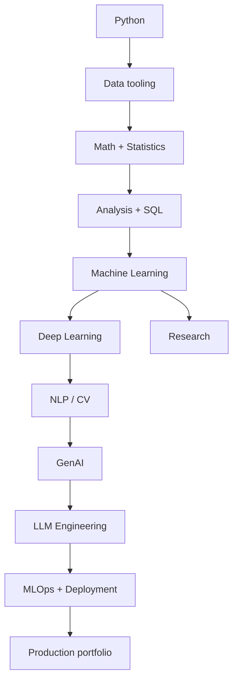

# Curriculum Map

```mermaid
flowchart TD
A[Python]-->B[Data tooling]
B-->C[Math + Statistics]
C-->D[Analysis + SQL]
D-->E[Machine Learning]
E-->F[Deep Learning]
F-->G[NLP / CV]
G-->H[GenAI]
H-->I[LLM Engineering]
I-->J[MLOps + Deployment]
E-->K[Research]
J-->L[Production portfolio]
```

The intended progression is cumulative: later chapters assume the engineering and mathematical habits developed earlier.
