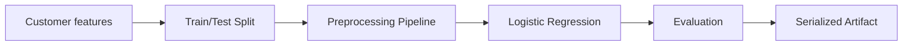

# Customer Churn Prediction

> A reproducible machine-learning project that turns customer behavior into a churn-risk prediction pipeline.

**Status:** Implemented learning project. Metrics are generated from a deterministic synthetic dataset and must not be interpreted as real-world business performance.

## What this demonstrates

- reproducible synthetic data generation
- train/test splitting with stratification
- numeric imputation + scaling
- categorical imputation + one-hot encoding
- leakage-safe `sklearn` Pipeline
- logistic regression baseline
- precision, recall, F1 and ROC-AUC
- persisted model artifact
- automated tests

## Architecture



## Run

```bash
cd projects/customer-churn
python -m pip install -r requirements.txt
python src/pipeline.py
pytest -q
```

## Engineering notes

The preprocessing and estimator are bundled into a single pipeline so inference receives the same transformations used during training. Unknown categorical values are tolerated, and missing values are handled inside the pipeline.

## Interview questions

1. Why should preprocessing be fitted only on training data?
2. Why use stratification for an imbalanced classification target?
3. Why is ROC-AUC different from accuracy?
4. What would data leakage look like in this project?
5. Why persist the entire pipeline instead of only the estimator?

## Limitations

This is an educational project. The dataset is synthetic, no production deployment is claimed, and no real customer decision should be made from the generated model.
