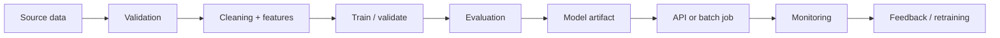

# Customer Segmentation

> **Status:** Architecture / learning project specification. No production performance, deployment, customer usage, or business impact is claimed until measured and documented.

## Problem

Define the real decision this system supports, who uses the output, when the prediction is made, and what happens after the prediction.

## Success criteria

Separate technical metrics from product outcomes. Define the primary metric, acceptable error types, latency/cost constraints and baseline before implementation.

## Data contract

Document source, license/usage rights, schema, target definition, prediction timestamp, missingness, class balance, leakage risks and train/validation/test split strategy.

## Architecture

## Implementation stages

1. Baseline without ML.
2. Data quality checks.
3. Exploratory analysis.
4. First interpretable model.
5. Stronger model and controlled comparison.
6. Error analysis.
7. Package inference.
8. Add tests and CI.
9. Containerize only after local reproducibility is stable.
10. Document limitations and rollback plan.

## Results table

| Experiment | Model | Metric | Split | Result | Notes |
|---|---|---|---|---:|---|
| Baseline | — | — | — | TBD | Run before tuning |

## Limitations

Document data coverage, bias, drift, uncertainty, operational constraints, unsupported inputs and cases where the system should defer to a human.

## Reproduction

Add exact environment setup, dataset instructions, configuration variables, training command, evaluation command and inference example when implementation is added.

## Evidence checklist

- [ ] Data source documented
- [ ] Baseline measured
- [ ] Metric justified
- [ ] Leakage audit completed
- [ ] Error analysis completed
- [ ] Tests added
- [ ] Reproduction verified
- [ ] Limitations documented
